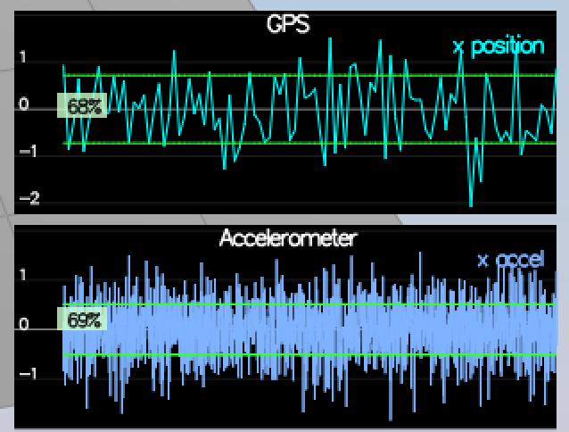
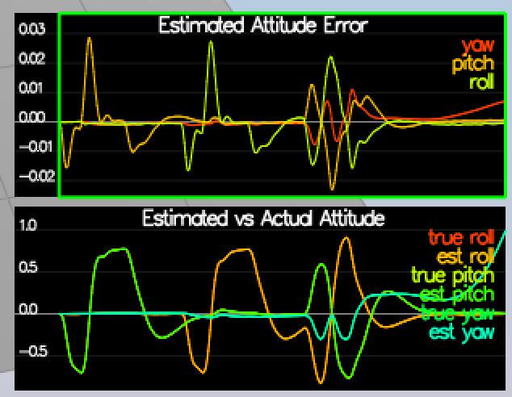
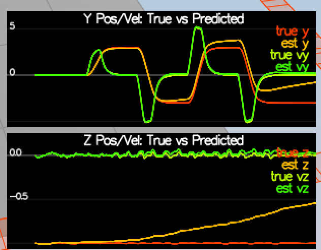
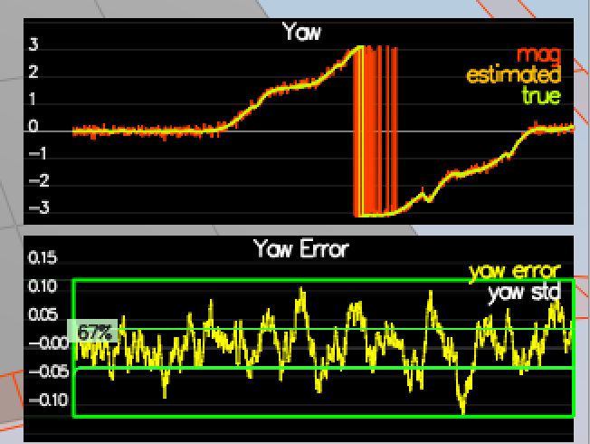
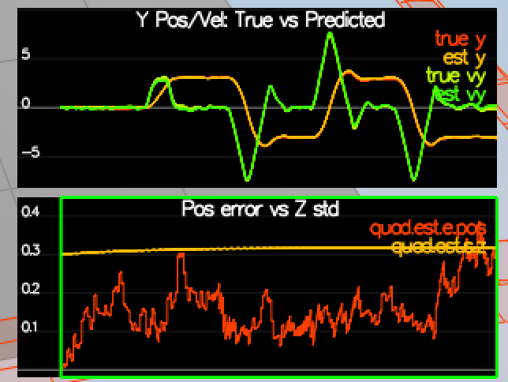
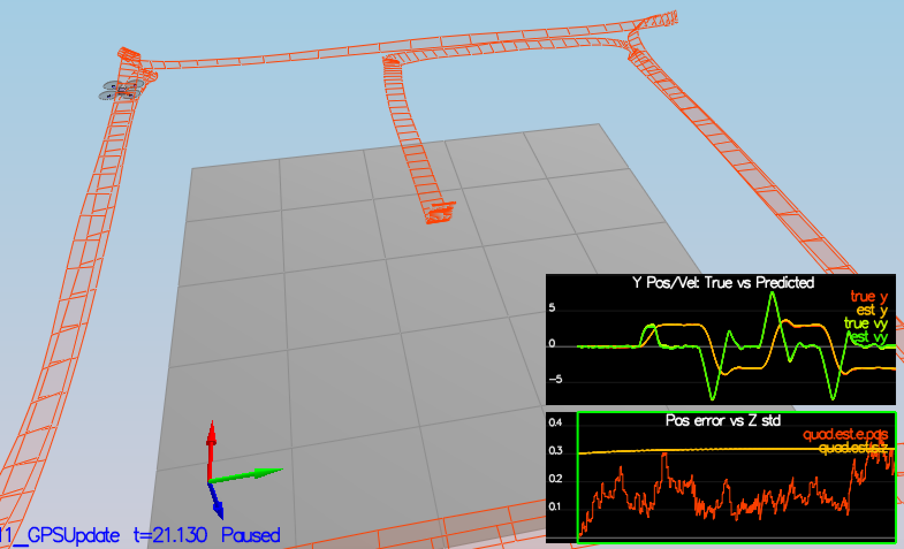

### WRITE UP

#### 1. Calculating Standard Deviation of Sensor Data

[This Code](https://github.com/tekjar/flying-car/blob/master/fcnd.projects/FCND-Estimation-CPP/stddev/stddev.py) calculates standard deviation of sensor data. 

NOTE: Allow simulator to run close to 10 seconds

#### 2. Better Attitude Estimation

Here I just used the provided `Quaternion<float>::FromEuler123_RPY` method to generate quaternions from roll, pitch and yaw and associated `IntegrateBodyRate` method

#### 3. Predict

This scenario contains a series of steps from the [paper](https://www.overleaf.com/read/vymfngphcccj#/54894644/)

* Following the transition model g(x, u, dt) to calculate predict state
* Use equation 52 from the estimation doc to create Rbg prime in `GetRbgPrime`
* Calculate the jacobian g'(x, u, dt) as described in equation 51
* Follow EKF pseudo code to update covariance matrix

#### 4. Magnetometer Update

* Use equation 58 to calculate H'
* Normalise measurement (or) prediction from state at boundaries

#### 5 & 6 Closed Loop + GPS Update + Controller

* Implement section 7.3.1 from the doc

